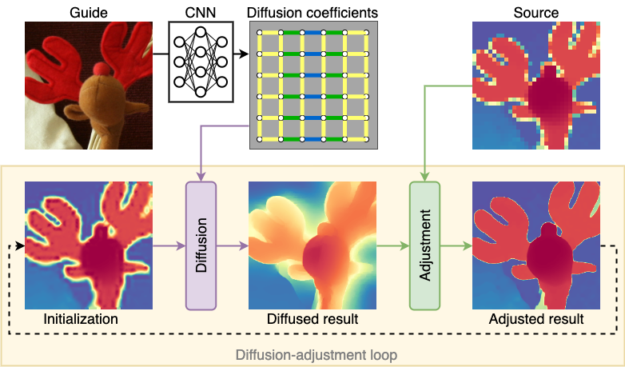

<p align="center">
<h2 align="center"> Guided Depth Super-Resolution by Deep Anisotropic Diffusion [CVPR2023] </h2>

<p align="center">
    <a href="https://nandometzger.github.io/"><strong>Nando Metzger</strong></a>*,
    <a href="https://rcdaudt.github.io/"><strong>Rodrigo Caye Daudt</strong></a>*,
    <a href="https://igp.ethz.ch/personen/person-detail.html?persid=143986"><strong>Konrad Schindler</strong></a>
</p>

<p align="center">
{metzgern, rodrigo.cayedaudt, schindler}@ethz.ch, Photogrammetry and Remote Sensing, ETH Zürich
</p>
<p align="center">
*Equal Contribution
</p>
<p align="center">
[<a href="https://arxiv.org/abs/2211.11592"><strong>Paper</strong></a>]
[<a href="https://www.youtube.com/watch?v=7RgXJz_3kcg"><strong>Video</strong></a>]
[<a href="https://rcdaudt.github.io/dada/"><strong>Project Page</strong></a>]
[<a href="https://openaccess.thecvf.com/content/CVPR2023/html/Metzger_Guided_Depth_Super-Resolution_by_Deep_Anisotropic_Diffusion_CVPR_2023_paper.html"><strong>Proceeding</strong></a>]
[<a href="https://drive.google.com/file/d/1xHmnH5F0ckmtB7OLWYtQ6oPF7oo79m8l/view?usp=sharing"><strong>Poster</strong></a>]
</p>
  
Performing super-resolution of a depth image using the guidance from an RGB image is a problem that concerns several fields, such as robotics, medical imaging, and remote sensing. While deep learning methods have achieved good results in this problem, recent work highlighted the value of combining modern methods with more formal frameworks. In this work we propose a novel approach which combines guided anisotropic diffusion with a deep convolutional network and advances the state of the art for guided depth super-resolution. The edge transferring/enhancing properties of the diffusion are boosted by the contextual reasoning capabilities of modern networks, and a strict adjustment step guarantees perfect adherence to the source image. We achieve unprecedented results in three commonly used benchmarks for guided depth super resolution. The performance gain compared to other methods is the largest at larger scales, such as x32 scaling. Code for the proposed method will be made available to promote reproducibility of our results.




## 🛠️ Setup

### 🐍💓 Dependencies
We recommend creating a new conda environment with all required dependencies by running
```bash
conda env create -f environment.yml
conda activate DADA-SR
```

### 💾🦌 Data
To reproduce our results, create a data directory (e.g. `./datafolder`) with the three datasets:
* **Middlebury**: Download the 2005-2014 scenes (full size, two-view) from [[here]](https://vision.middlebury.edu/stereo/data/) and place the extracted scenes in `./datafolder/Middlebury/<year>/<scene>`. For the 2005 dataset, make sure to only put the scenes for which ground truth is available. The data splits are defined in code.
* **NYUv2**: Download the labeled dataset from [[here]](https://cs.nyu.edu/~silberman/datasets/nyu_depth_v2.html) and place the `nyu_depth_v2_labeled.mat` in `./datafolder/NYU Depth v2`, the split file is already provided in this repository at `data/split_idc_nyuv2.json`.
* **DIML**: Download the indoor data sample from [[here]](https://dimlrgbd.github.io) and extract it into `./data/DIML/{train,test}` respectively. Then run `python scripts/create_diml_npy.py ./datafolder/DIML` to create numpy binary files for faster data loading.

Your folder structure should look like this:
```
datafolder
└───Middlebury
│   └───2005
│   │   └───Art
│   │   |   |   disp1.png
│   │   |   |   disp5.png
│   │   |   |   dmin.text
│   │   |   └───Illum1
│   │   |   └───Illum2
│   │   |   └───Illum3
│   │   │   ...
│   └───...
│   
└───NYUv2
│       nyu_depth_v2_labeled.mat
│
└───DIML
│   └───train
│   │   └───HR
│   │   └───LR
│   └───test
│   │   └───HR
│   │   └───LR
│   └───npy
│       <...will be generated by create_diml_npy.py...>

```

### 🚩💾 Checkpoints
Our pretrained model checkpoints can be downloaded [here](https://drive.google.com/file/d/1pfJ94vkDl6OQQ4QYItRxEbEjPhalrs_5/view?usp=share_link).

## 🆕 Focal Frequency Loss with Phase Consistency
We've extended DADA with a spectral-domain loss function called Focal Frequency Loss that provides greater emphasis on high-frequency details. This loss includes:

1. **Magnitude Component**:
   - Computes the 2D FFT of both predicted and ground-truth depth maps using `torch.fft.fft2`
   - Applies greater weights to higher frequencies
   - Uses a non-linear focal weighting mechanism where harder-to-learn frequencies contribute more to the loss

2. **Phase Consistency Component**:
   - Extracts the phase (angle) from the FFT outputs using `torch.angle()`
   - Computes the phase difference between predicted and ground-truth depth in the frequency domain
   - Penalizes phase misalignment, encouraging better structural reconstruction
   - Focuses on high-frequency components and areas with strong signal magnitude

3. **Focal Weighting Options**:
   - **Sigmoid-based**: `1 - exp(-λ * rel_error)` emphasizes frequencies with larger relative errors
   - **Log-based**: `log(1 + rel_error * 10)^γ` provides smoother weighting for harder examples

### Training with Frequency Loss
To train with the Focal Frequency Loss, use:

```bash
# Using sigmoid-based focal weighting (default)
python run_train.py --dataset Middlebury --data-dir ./datafolder/ --save-dir ./save_dir/ --loss frequency --freq-alpha 1.0 --freq-beta 0.5 --focal-lambda 0.5 --wandb --num-epochs 4500 --scaling 8 --val-every-n-epochs 10 --lr-step 100 --in-memory

# Using log-based focal weighting
python run_train.py --dataset Middlebury --data-dir ./datafolder/ --save-dir ./save_dir/ --loss frequency --freq-alpha 1.0 --freq-beta 0.5 --use-log-focal --focal-gamma 2.0 --wandb --num-epochs 4500 --scaling 8 --val-every-n-epochs 10 --lr-step 100 --in-memory

# Using spectral loss as an additional loss with standard L1 loss
python run_train.py --dataset Middlebury --data-dir ./datafolder/ --save-dir ./save_dir/ --loss l1 --use_spectral_loss --spectral_loss_weight 0.3 --freq-alpha 1.0 --freq-beta 0.5 --use-log-focal --focal-gamma 2.0 --wandb --num-epochs 4500 --scaling 8 --val-every-n-epochs 10 --lr-step 100 --in-memory

# Using Automatic Mixed Precision (AMP) for faster training with less memory usage
python run_train.py --dataset NYUv2 --data-dir ./datafolder/ --save-dir ./save_dir/ --loss l1 --use_spectral_loss --spectral_loss_weight 0.4 --use_amp --wandb --num-epochs 550 --scaling 8 --val-every-n-epochs 4 --lr-step 10 --in-memory
```

Parameters:
- `--loss`: Choose between `l1` (original), `frequency` (our new loss), or `hybrid` (combination)
- `--use_spectral_loss`: Add spectral loss as a complementary loss to the primary loss type
- `--spectral_loss_weight`: Weight for the spectral loss when used as an additional loss (0.0-1.0)
- `--freq-alpha`: Weight for magnitude component in frequency loss (default: 1.0)
- `--freq-beta`: Weight for phase component in frequency loss (default: 1.0)
- `--use-log-focal`: Use logarithmic-based focal weighting instead of sigmoid-based
- `--focal-lambda`: Controls strength of sigmoid-based focal weighting (higher = stronger effect, default: 0.5)
- `--focal-gamma`: Controls strength of log-based focal weighting (higher = stronger effect, default: 2.0)
- `--hybrid-weight`: Weight for frequency loss in hybrid loss (freq*w + l1*(1-w))
- `--use_amp`: Enable Automatic Mixed Precision training for faster training and reduced memory usage

### Evaluation with Frequency Loss
For evaluation with the frequency loss:

```bash
# Standard evaluation with frequency loss
python run_eval.py --dataset <...> --data-dir ./datafolder/ --checkpoint ./save_dir/experiment_<...>/best_model.pth --scaling <...> --loss frequency --freq-alpha 1.0 --freq-beta 0.5 --focal-lambda 0.5

# Evaluation with log-based focal weighting
python run_eval.py --dataset <...> --data-dir ./datafolder/ --checkpoint ./save_dir/experiment_<...>/best_model.pth --scaling <...> --loss frequency --freq-alpha 1.0 --freq-beta 0.5 --use-log-focal --focal-gamma 2.0

# Evaluation with added spectral loss component
python run_eval.py --dataset <...> --data-dir ./datafolder/ --checkpoint ./save_dir/experiment_<...>/best_model.pth --scaling <...> --loss l1 --use_spectral_loss --spectral_loss_weight 0.3 --freq-alpha 1.0 --freq-beta 0.5

# Evaluation with AMP for faster evaluation on GPUs
python run_eval.py --dataset <...> --data-dir ./datafolder/ --checkpoint ./save_dir/experiment_<...>/best_model.pth --scaling <...> --use_amp
```

### Debugging Tips

If you encounter issues with the frequency loss:

1. **Memory Usage**: The FFT operation can be memory intensive. If you encounter out-of-memory errors:
   - Reduce batch size
   - Enable AMP with `--use_amp`
   - Try using a smaller crop size

2. **NaN Values**: If training diverges or produces NaN values:
   - Check the error by adding `print(torch.isnan(pred).any(), torch.isnan(target).any())` to debug
   - Try reducing the focal weighting strength (`--focal-lambda` or `--focal-gamma`)
   - Use a smaller learning rate

3. **Hyperparameter Tuning**:
   - Start with `--freq-alpha 1.0 --freq-beta 0.5` (equal weight to magnitude, half to phase)
   - For log-based focal weighting, start with `--focal-gamma 2.0`
   - For sigmoid-based focal weighting, start with `--focal-lambda 0.5`

## 🏋️ Training

Run the training script via
```bash
python run_train.py --dataset Middlebury --data-dir ./datafolder/ --save-dir ./save_dir/ --wandb --num-epochs 4500 --scaling 8 --val-every-n-epochs 10 --lr-step 100 --in-memory
python run_train.py --dataset NYUv2 --data-dir ./datafolder/ --save-dir ./save_dir/ --wandb --num-epochs 550 --scaling 8 --val-every-n-epochs 4 --lr-step 10 --in-memory
python run_train.py --dataset DIML --data-dir ./datafolder/ --save-dir ./save_dir/ --wandb --num-epochs 300 --scaling 8 --val-every-n-epochs 2 --lr-step 6 --in-memory
```
or use the prepared setups in ```.vscode/launch.json```. 

Note, that depending on the dataset, you have to adjust the number of epochs (`--num-epochs`) and the scheduler step size (`--lr-step`), as listed in the commands above. You can see all available training options by running 
```bash
python run_train.py -h
```

## 🧪 Testing

For test set evaluation, run

```bash
python run_eval.py --dataset <...> --data-dir ./datafolder/ --checkpoint ./save_dir/experiment_<...>/best_model.pth --scaling <...>
```
Again, you can query all available options by running 
```bash
python run_eval.py -h
```

## 🎓 Citation

```
@article{metzger2022guided,
  title={Guided Depth Super-Resolution by Deep Anisotropic Diffusion},
  author={Metzger, Nando and Daudt, Rodrigo Caye and Schindler, Konrad},
  journal={arXiv preprint arXiv:2211.11592},
  year={2022}
}
```

## 🙏 Acknowledgement
 - A big thank you to the authors of the [Learned Graph Regularizer](https://github.com/prs-eth/graph-super-resolution) for providing the code framework.